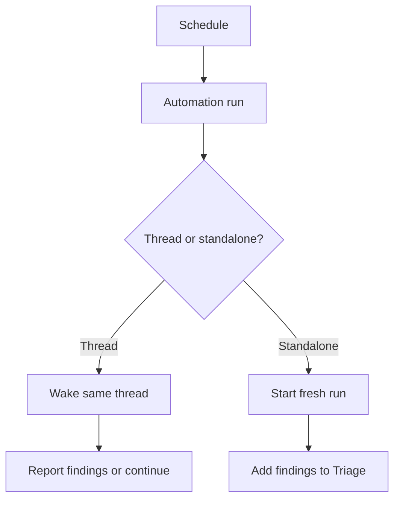

# Using Automations with Codex

**Automations** let Codex run recurring or scheduled tasks in the background.
They are useful when you want Codex to check something later, monitor a project,
or keep returning to a thread while external work finishes.

Automations are powerful because they run without you continuously prompting
them. That also makes them higher-risk than normal interactive Codex work.

## Why Use Automations

Use automations when the useful action is time-based or recurring. They are a
good fit for checking back later, polling for status, producing a regular
digest, or rerunning a known workflow without keeping a human in the loop every
few minutes.

Automations are most valuable when the task has a clear cadence and a clear
"nothing to report" outcome. They turn Codex from a one-off collaborator into a
background monitor for work that would otherwise interrupt you.

Do not use automations for broad unsupervised implementation. If the task needs
judgment, credentials, destructive actions, or unclear stopping conditions, keep
it interactive.

## The Mental Model

There are two common automation shapes:

- **Thread automation:** Wakes up the current thread on a schedule and preserves
  the conversation context.
- **Standalone or project automation:** Starts independent runs on a schedule
  and reports findings into the automation inbox or triage area.

Use thread automations when continuity matters. Use standalone automations when
each run should be independent.

For project-scoped automations, the machine running the local Codex app must be
powered on, Codex must be running, and the selected project must still be
available on disk when the automation is scheduled to run.



## When To Use Automations

Good automation tasks:

- Check a pull request until CI finishes.
- Revisit a deployment or long-running command.
- Monitor a repository for new review feedback.
- Run a scheduled cleanup audit.
- Produce a daily or weekly digest from a connected source.
- Re-run a skill-driven workflow on a cadence.

Poor automation tasks:

- Broad feature implementation without human review.
- Anything requiring repeated secret entry.
- High-risk account, billing, or production actions.
- Background work with full filesystem or network access and no constraints.
- Tasks where the stop condition is unclear.

## Triage And No-Finding Runs

Automation runs that find something actionable should report it in the Codex
automation inbox or triage surface. Runs with nothing important to report can
archive themselves automatically when the prompt says that is allowed.

That "nothing to report" behavior is worth writing explicitly. Without it,
background checks can create noise even when the project is healthy.

## Project Mode And Worktrees

In Git repositories, an automation can run in the local project or in a new
worktree.

Use a worktree when:

- The automation might edit files.
- You are actively working in the main checkout.
- You want the diff isolated from unfinished local work.
- The automation may need multiple follow-up runs.

Use the local project only when:

- The task is read-only.
- You intentionally want the automation to update the current checkout.
- You understand that it can modify files you are editing.

For Store Pulse, prefer worktrees for recurring code tasks. The project is
small, but isolation keeps workshop and participant edits easier to reason
about.

## Sandbox And Approval Behavior

Automations use your default sandbox settings. Because they run unattended,
those defaults matter.

Practical guidance:

- **Read-only:** Good for monitoring and reporting. File edits and many tool
  calls will fail.
- **Workspace-write:** Good default for bounded project automations.
- **Full access:** High risk for unattended work. Avoid unless the surrounding
  environment is already constrained.

Automations may use non-interactive approval behavior when policy allows it. If
your organization blocks non-interactive approval mode, the automation falls
back to the allowed behavior.

## Skills And Plugins

Automations can use the same skills and plugins available to Codex.

Use skills to make automations maintainable:

```text
Every weekday at 8:00 AM, use $store-pulse-feature-implementation to inspect
the Store Pulse repository for failing verification gates. If all gates pass,
archive the run. If anything fails, summarize the failing command, likely cause,
and recommended next step.
```

Use plugins when the automation needs external data:

- GitHub for pull request and CI monitoring.
- Slack for channel digests.
- Gmail for inbox triage.
- Google Calendar for daily briefings.

Keep plugin permissions narrow and review the first few runs.

## Writing Durable Automation Prompts

Automation prompts need more detail than one-off prompts because they run later
without conversational repair.

Include:

- What Codex should check.
- Which project or thread it applies to.
- Which tools or skills it may use.
- What counts as a finding.
- What to do when there is nothing to report.
- When to stop or ask for input.
- Verification commands or source checks.
- Safety boundaries.

Weak prompt:

```text
Check the project every day.
```

Better prompt:

```text
Every weekday morning, inspect the Store Pulse repository. Run npm run lint and
npm run test. If both pass and there are no unexpected local changes, archive
the run with no findings. If a command fails, report the first useful error,
the likely owner file, and the narrowest next action. Do not edit files.
```

## Testing An Automation

Before scheduling an automation, run the prompt manually in a normal thread.

Confirm:

- Codex understands the task.
- The right project is selected.
- The selected tools are available.
- The output is useful.
- Any diff is reviewable.
- The stop condition is clear.

Review the first few scheduled runs. Adjust cadence, prompt wording, tools, or
sandbox settings before trusting it.

## Worktree Cleanup

Recurring automations that use worktrees can create many background worktrees.

Cleanup rules:

- Archive runs you no longer need.
- Avoid pinning runs unless you want to preserve the worktree.
- Periodically inspect worktrees if a frequent automation edits files.
- Do not delete worktrees blindly while a run may still be active.

## Store Pulse Automation Ideas

Read-only daily check:

```text
Every weekday at 9:00 AM, inspect Store Pulse. Run npm run lint and npm run
test. If both pass, archive the run. If either fails, report the command, first
useful error, and likely next step. Do not edit files.
```

Pull request stabilization:

```text
Every 15 minutes while this pull request is open, check GitHub review threads
and CI status. If checks are pending, report pending status only. If a check
fails or a review thread needs attention, summarize the blocker and ask before
editing. Stop when the pull request is merged or closed.
```

Workshop readiness:

```text
Every Monday morning, inspect the Store Pulse workshop repository. Confirm that
reference/one-hour-workshop.md exists, npm run lint passes, and npm run test
passes. Report only failures or unexpected local changes. Do not edit files.
```

## Checklist

Before enabling an automation:

- The task is scoped.
- The cadence is justified.
- The prompt has a clear no-finding behavior.
- The prompt has a stop or escalation condition.
- Sandbox settings are safe for unattended execution.
- Worktree behavior is explicit for Git repositories.
- Required skills and plugins are installed.
- The prompt has been tested manually.
