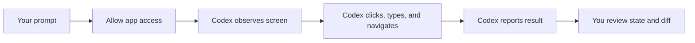

# Computer Use with Codex and How It Works

**Computer Use** lets Codex see and operate graphical applications on your
computer. It is for tasks where files, terminal commands, MCP tools, or a
browser preview are not enough.

Use it deliberately. Computer Use can interact with state outside the
repository, so the right default is a scoped task, explicit app permission, and
human review.

## Why Use Computer Use

Use Computer Use when the important evidence lives in a graphical interface.
Some bugs only appear in a desktop app, simulator, signed-in browser, settings
panel, or workflow that has no clean command-line or API surface.

Computer Use lets Codex observe the same UI a user sees, operate the app, and
connect that visual behavior back to code changes. That makes it useful for
reproducing bugs, verifying fixes, and handling workflows that span multiple
apps.

Do not use Computer Use when a structured tool would work. Files, tests, MCP
servers, plugins, and the in-app browser are easier to scope and easier to
audit.

## The Mental Model

Most Codex work happens through structured tools:

- Read and edit files.
- Run shell commands.
- Use MCP servers or plugins.
- Inspect browser pages through the in-app browser.

Computer Use is different. Codex observes a graphical interface and sends UI
actions such as clicks and keystrokes to an allowed app.



That makes it powerful for desktop and signed-in workflows, but weaker than
structured APIs for repeatable data access. Prefer a plugin, MCP server, local
file, or command-line interface when one exists.

## Availability And Setup

Computer Use is available in the Codex app on supported platforms. Current
public documentation describes macOS and Windows support, with regional
availability limitations at launch.

On macOS, Codex needs system permissions:

- **Screen Recording:** Lets Codex see the target app.
- **Accessibility:** Lets Codex click, type, and navigate.

Install and enable the Computer Use plugin from Codex settings before asking
Codex to operate desktop apps. If Codex cannot see or control the app, check
system privacy settings and the app-level permission prompt inside Codex.

## When To Use Computer Use

Use Computer Use when the task depends on a graphical interface.

Good fits:

- Reproduce a bug in a desktop app.
- Verify an Electron, macOS, Windows, simulator, or browser flow visually.
- Change settings that only exist in an app UI.
- Use a data source that has no available plugin or MCP server.
- Execute a workflow across more than one app.
- Work with a signed-in browser flow when a browser-specific tool is required.

For local web apps, use the in-app browser first. It is easier to scope, easier
to review, and does not use your signed-in Chrome profile.

## How To Prompt It

Name the app and the exact flow.

```text
Use Computer Use to open the Store Pulse app in the browser, reproduce the
overflow on the inventory table, and report what you see. Do not edit files
until you have described the visual failure.
```

For app-specific plugins, invoke the plugin directly when available:

```text
@Chrome open the signed-in staging dashboard and verify the low-stock panel
after the latest local build.
```

Use Computer Use for visual state. Use repository tools for code changes and
verification commands.

## Permissions And Approvals

Computer Use has multiple permission layers:

- System permissions let Codex see and operate apps.
- Codex app permissions decide which apps Codex may use.
- Thread sandbox settings still apply to file reads, file edits, and shell
  commands.
- Sensitive actions may require extra confirmation.

Allow an app only when the task requires it. Use "always allow" only for apps
you are comfortable letting Codex operate in future tasks.

## Safety Rules

Computer Use can see visible content, screenshots, windows, clipboard state,
and signed-in pages in the apps you allow. Treat that content as context Codex
may process.

Use these rules:

- Give Codex one app or flow at a time.
- Keep sensitive apps closed unless they are required.
- Stay present for account, security, privacy, payment, or credential flows.
- Cancel the task if Codex moves to the wrong app or window.
- Avoid asking Codex to handle secrets.
- Review the result as if a teammate had operated your computer.
- Prefer a plugin or MCP server for structured data access.

On Windows, Computer Use operates on the active desktop, so expect Codex to
move the pointer and type in the foreground. On macOS, background and locked-use
workflows have additional system-level constraints and should be used only when
you understand the permission model.

## What Computer Use Should Not Do

Do not use Computer Use to bypass Codex safety boundaries.

Avoid:

- Approving operating-system security prompts.
- Authenticating as an administrator.
- Automating Codex itself.
- Operating terminal apps to bypass command approvals.
- Performing broad account or billing changes without supervision.
- Handling private data when a safer connector or file export would work.

If a task needs broad desktop access to be useful, narrow the task instead.

## Store Pulse Workshop Fit

For Store Pulse, Computer Use is optional. Most workshop verification should
use files, tests, and the in-app browser. Reach for Computer Use only when the
lesson needs to show Codex working with an external desktop application or a
signed-in browser flow that cannot be reproduced locally.

Workshop-safe prompt:

```text
Use Computer Use only to inspect the rendered Store Pulse dashboard in the
browser. Do not open other apps. Do not edit files until you report the visual
state you observed.
```

That prompt keeps Computer Use observational first, which is the safest way to
teach it.

## Checklist

Before using Computer Use:

- The task depends on a graphical app.
- A plugin, MCP server, file, or command-line tool would not be better.
- The target app is named.
- Sensitive apps and pages are closed.
- You understand the app permission prompt.
- You are prepared to stop the task if it leaves the intended flow.
