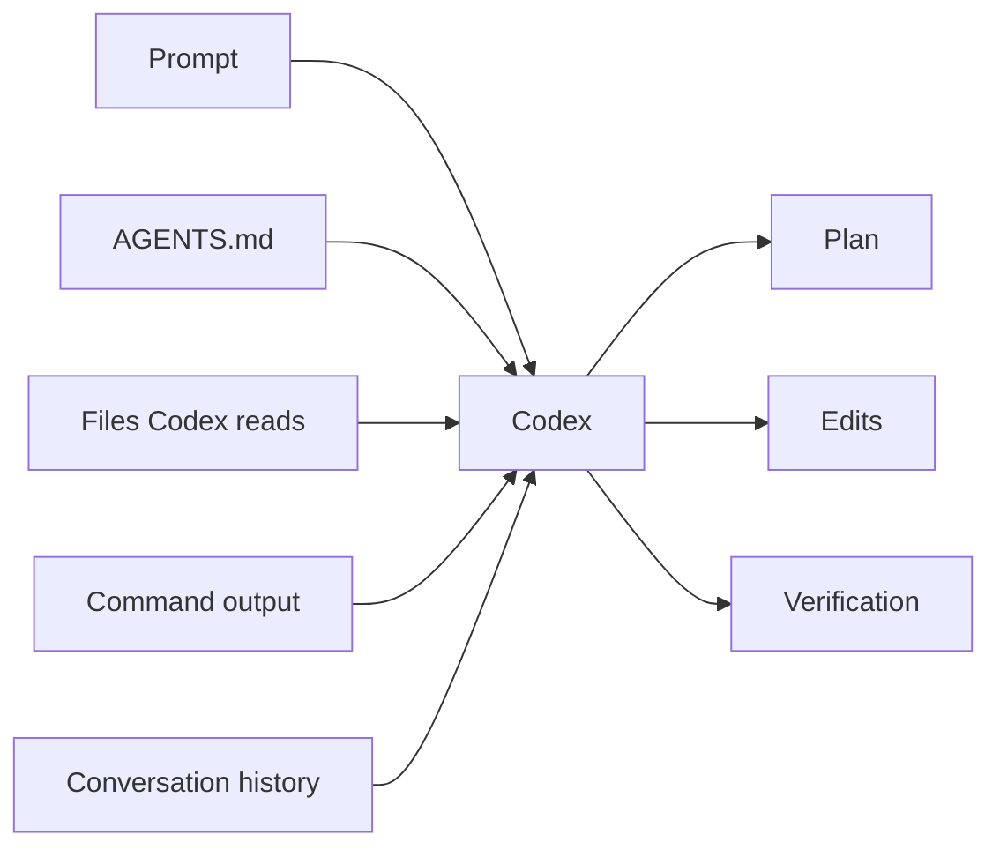

# Context Management with Codex

Codex is only as effective as the context it can see and the instructions it can
trust. Good context management is the difference between a focused collaborator
and a model guessing from stale fragments.

The goal is not to paste everything into the prompt. The goal is to make the
right context easy to discover, keep important decisions in files, and reset the
conversation when the working set changes.

## The Mental Model

Codex builds a working picture from several sources:

- The current user prompt.
- The current conversation.
- Project instructions such as `AGENTS.md`.
- Files it reads from the repository.
- Tool output from commands it runs.
- Mentioned files, images, or external context.
- Configuration, safety, and tool instructions from the current environment.

Codex does not automatically know every file in the repository. It can search
and read files, but it needs enough direction to know where to look and what
question it is trying to answer.



The best prompts tell Codex what outcome you want, where to start, and what
counts as done. The best repositories put durable project truth in files instead
of relying on conversation memory.

## What Belongs Where

**Repository instructions:** Put durable project rules in `AGENTS.md`.

Examples:

- Package manager.
- Project layout.
- Naming conventions.
- Test commands.
- Schema-change rules.
- Domain semantics.
- Out-of-scope work.

**Task prompts:** Put temporary task intent in the prompt.

Examples:

- The specific feature to implement.
- The acceptance criteria.
- The files to inspect first.
- The verification commands for this task.
- What should be left alone.

**Reference guides:** Put reusable teaching material in `reference/`.

Examples:

- Prompting practices.
- Safety model.
- Worktree workflow.
- Subagent guidance.
- Troubleshooting.

**Code comments:** Put implementation-specific explanations beside code only
when they clarify something that would otherwise be hard to infer.

Do not use conversation history as the only place where important state lives.
If the decision matters after this session, write it down.

## Start with the Repository

Good Codex work starts with inspection.

```text
Inspect AGENTS.md, package.json, prisma/schema.prisma, and the relevant app and
lib files before planning. Do not edit files yet.
```

For Store Pulse feature work, good starting points are:

- `AGENTS.md`
- `package.json`
- `prisma/schema.prisma`
- `prisma/seed.ts`
- `app/page.tsx`
- `app/stores/[id]/page.tsx`
- `lib/dashboard.ts`
- `lib/metrics.ts`
- `tests/unit/`

You do not need to mention every file every time. Mention the files that define
the task boundary, then let Codex search from there.

## Mention Files Deliberately

Use file mentions when you know the relevant file:

```text
Use @reference/next-prompts.md and @lib/metrics.ts as the starting point.
```

Inside Codex, `/mention` can attach files or directories to the current prompt.
Use it when:

- The file is central to the task.
- You want Codex to compare two files.
- A screenshot, image, or artifact matters.
- A previous search missed the relevant file.

Avoid mentioning large directories just because they exist. More context is not
automatically better. It can crowd out the part that matters.

## Ask for Evidence

When the task is non-trivial, ask Codex to report what it inspected:

```text
Before implementing, summarize which files you inspected and what each one
contributes to the change.
```

Useful evidence:

- File paths.
- Function names.
- Existing test names.
- Relevant schema fields.
- Commands run.
- Failure messages.

Weak evidence:

- "The app appears to..."
- "It probably uses..."
- "We should be able to..."
- A plan that names no files.

The point is not to make Codex verbose. The point is to make sure the plan is
grounded in the actual repository.

## Keep the Working Set Small

A good Codex task has a coherent working set.

Good scope:

```text
Add reorder suggestions to low-stock inventory rows on the dashboard and store
detail page. Put the calculation in a pure helper and add unit tests.
```

Too broad:

```text
Improve inventory management across the app.
```

When the task is broad, split it:

- Data model work.
- Pure calculation logic.
- Dashboard rendering.
- Store detail rendering.
- Tests.

Codex can help split the task, but the final implementation prompt should still
name one coherent unit of work.

## Use `/status`

Use `/status` when you need to reorient.

It answers questions like:

- Which directory is this session using?
- What sandbox and approval mode are active?
- What model is active?
- What project instructions were loaded?

Run it before high-risk work, after resuming an old session, or when Codex seems
to be acting on stale assumptions.

## Use `/diff`

Use `/diff` to inspect local changes without leaving Codex.

Good times to use it:

- After Codex finishes an implementation pass.
- Before asking Codex to refactor.
- Before running final verification.
- Before committing.

Prompt pattern:

```text
Review the current diff. Identify any unnecessary changes, missing tests, or
places where the implementation drifted from the prompt. Do not edit files yet.
```

This turns the diff into context instead of assuming the conversation remembers
exactly what changed.

## Use `/compact`

Use `/compact` when the conversation is long but the task is still active.

Compaction keeps the session going while compressing older context. It is useful
after:

- A long investigation.
- Several failed test runs.
- A large implementation pass.
- A completed subtask before the next subtask begins.

Before compacting, make sure the important state exists in the repository or in
a concise message:

```text
Before compacting, summarize the current goal, changed files, failing command,
and next action.
```

Then compact:

```text
/compact
```

Compaction is not a substitute for writing durable notes when the decision needs
to survive the session.

## Start a New Session

Start a new session when the task changes substantially.

Good reasons:

- You finished one feature and are starting another.
- The conversation contains a lot of abandoned approaches.
- Codex keeps anchoring on old assumptions.
- You want a clean review-only pass.
- You are switching from setup to implementation.

Use:

```text
/new
```

Or start from the terminal:

```bash
codex "Inspect this repository and plan the incident timeline feature."
```

The cost of a fresh session is reloading context. The benefit is a cleaner
working memory.

## Resume Carefully

Use `/resume` when continuing the same line of work.

After resuming, run:

```text
/status
```

Then ask Codex to restate the active state:

```text
Summarize the current task, changed files, verification status, and next step
before doing more work.
```

This catches stale or incomplete memory before Codex edits files.

## Fork When Exploring

Use `/fork` when you want to explore a different approach without polluting the
main conversation.

Good uses:

- Compare two implementation strategies.
- Try a risky refactor in a separate thread.
- Ask for a skeptical review without interrupting the current flow.
- Investigate a failure while the main session stays focused.

Do not fork just to avoid making a decision. Forks still need a clear question
and a synchronization point.

## Persist State in Files

For longer work, write state to files:

- A plan in `tmp/PLAN.md`.
- A checklist in `reference/`.
- A failing test that captures the bug.
- A small reproduction script.
- A notes file under `tmp/` for temporary investigation state.

Good state file:

```text
Goal: Add smart reorder suggestions.
Touched files:
- lib/inventory.ts
- tests/unit/inventory.test.ts
- app/page.tsx

Verification:
- npm run lint: passing
- npm run test: failing in inventory.test.ts

Next action:
- Fix expected reorder quantity for zero stock case.
```

Bad state file:

```text
Need to fix stuff later.
```

## Manage Failure Context

When a command fails, keep the failure visible:

```text
npm run test failed in tests/unit/inventory.test.ts. Diagnose that failure from
the output, inspect the implementation, and fix the underlying issue. Do not
skip the test.
```

Do not bury failure output under a new unrelated prompt. The next prompt should
name the command, the failing test or file, and the constraint that skipping is
not acceptable.

After two failed attempts at the same fix, stop and re-diagnose:

```text
Stop patching. Re-read the failing test, the implementation, and the domain
rules. Explain the mismatch before making another edit.
```

## Context Smells

Watch for these signs that the session needs better context:

- Codex proposes a framework the repository does not use.
- Codex names files that do not exist.
- Codex says "probably" about something easy to inspect.
- Codex changes files outside the requested scope.
- Codex forgets a constraint from `AGENTS.md`.
- The same test fails repeatedly with different speculative fixes.
- The prompt says "also" too many times.
- The conversation has multiple abandoned plans.

Fix context problems before asking for more implementation.

## Store Pulse Context Starter

Use this prompt when beginning a Store Pulse feature:

```text
Inspect AGENTS.md, package.json, prisma/schema.prisma, prisma/seed.ts, and the
files relevant to this feature. Summarize the existing patterns before planning.
Do not edit files until the plan is clear.

Feature:
<paste the feature request>

Constraints:
- Use npm commands from package.json.
- Keep database access in lib/.
- Prefer pure helpers for logic that can be unit tested.
- Add or update Vitest tests for calculation behavior.
- Run npm run lint and npm run test before finishing.
```

Use this prompt when the session has drifted:

```text
Pause and reorient. Use git status, inspect the current diff, and summarize:
the original goal, files changed, verification commands run, failures still
present, and the smallest next action. Do not edit files yet.
```

## Rule of Thumb

If Codex is guessing, give it better context.

If Codex is overloaded, narrow the working set.

If Codex is remembering too much stale context, start a new session.

If a decision matters beyond this conversation, write it into a file.
