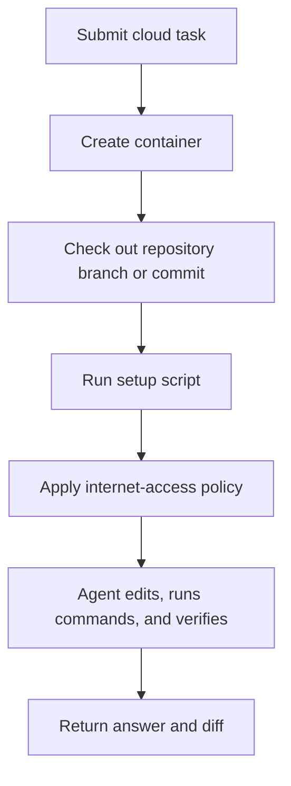

# Using Environments with Codex

Codex uses the word **environment** in two related ways:

- **Cloud environments:** Container setup for Codex cloud tasks.
- **Local environments:** Project setup scripts and reusable actions in the
  Codex app for local worktrees.

The mental model is simple: an environment is the repeatable part of "make this
project runnable before Codex starts doing the interesting work." Good
environments remove setup friction. Bad environments hide fragile state,
surprise the agent with missing tools, or give background tasks more access
than they need.

## Why Use Environments

Use environments when "works on my machine" would otherwise slow Codex down.
They make setup repeatable, define the tools Codex can rely on, and keep cloud
or worktree runs from starting in a half-configured project.

For a workshop, environments are how you make every participant and every
background task start from the same baseline. Codex can spend time inspecting,
planning, testing, and implementing instead of rediscovering missing
dependencies.

Use the simplest environment that proves the project can run. If the
environment becomes more complex than the feature work, it is probably carrying
too much responsibility.

## Cloud Environments

Cloud environments control what Codex installs and runs when a hosted Codex
task starts. Use them when Codex is working away from your local checkout.

A cloud task generally follows this path:



Use cloud environments to define:

- Runtime versions such as Node.js, Python, or other language tools.
- Setup scripts that install dependencies and prepare the repository.
- Optional maintenance scripts for cached containers.
- Environment variables.
- Secrets needed during setup.
- Internet access during the agent phase.

For Store Pulse, a basic cloud setup should stay boring:

```bash
npm install
npm run lint
npm run test
```

Do not configure a second package manager for this repository. Store Pulse
checks in `package-lock.json`, so the environment should use `npm`.

## Setup Scripts

Setup scripts run before the agent starts working. They are the right place to
install dependencies, generate clients, and prepare local state that every run
needs.

For Store Pulse, the repository already has a setup path:

```bash
npm install
```

When `.env` is missing, the `postinstall` hook runs:

```bash
npm run setup
```

That command copies `.env.example`, generates the Prisma client, applies
migrations, and seeds the SQLite database.

Use setup scripts for reproducible setup. Do not use them for feature-specific
commands such as "add smart reorder suggestions." The agent prompt should own
the task; the environment should own the project baseline.

## Environment Variables And Secrets

Use environment variables for non-secret configuration and secrets for values
that should not be exposed during the agent phase.

Important distinction:

- **Environment variables:** Available for the full task, including setup and
  the agent phase.
- **Secrets:** Available to setup scripts, then removed before the agent phase.

That distinction matters. If a token is needed only to install private
dependencies, make it a secret. If the agent must use a value while running
tests, treat that as a higher-risk design and prefer a narrow test-only token
or a mocked service.

For Store Pulse, do not add real production credentials. It is a demo
application with a local SQLite database.

## Container Caching

Cloud environments can cache container state to make follow-up tasks faster.
Caching is useful, but it can hide stale dependencies.

Reset the cache when:

- The setup script changes.
- Dependency files change in a way that the cache does not pick up.
- Environment variables or secrets change.
- Codex reports setup behavior that does not match the current repository.

If a cached environment produces confusing failures, ask Codex to compare the
current branch, setup script, dependency files, and cache state before patching
the application.

## Internet Access

Cloud setup scripts have internet access so dependencies can install. Agent
internet access is separate and should stay as narrow as the task allows.

For a Store Pulse workshop:

- Setup may need network access for `npm install` or Playwright browser
  installation.
- Feature implementation should not need network access.
- External API calls are out of scope for the demo app.

If a task asks Codex to browse current product documentation, allow only the
specific research needed and ask it to cite the source. If a task asks Codex to
add app behavior, prefer local files and tests.

## Local Environments

Local environments configure setup steps and common actions for local Codex app
worktrees. They live under the project `.codex` folder and can be checked into
the repository when the configuration is safe for everyone.

Use local environments for:

- Worktree setup scripts.
- Common actions such as starting a development server.
- Test or build actions that participants can run from the Codex app.
- Platform-specific setup differences for macOS, Windows, or Linux.

For Store Pulse, useful actions are:

```bash
npm run dev
```

```bash
npm run lint
npm run test
```

```bash
npm run build
```

Keep local environment actions short and explicit. If an action needs a long
explanation, it probably belongs in `reference/getting-started.md` or
`AGENTS.md` instead.

## Local Environment Safety

Local environment setup can run automatically when Codex creates a worktree.
Treat it like any other repository-controlled automation.

Good setup scripts:

- Install dependencies with the repository package manager.
- Generate local clients or build artifacts.
- Avoid destructive commands.
- Avoid secrets.
- Fail loudly when setup cannot complete.

Poor setup scripts:

- Delete untracked files.
- Reset branches.
- Start long-running processes without clear ownership.
- Depend on a developer's private machine state.
- Hide failures behind `|| true`.

## Store Pulse Recommendation

For this workshop, keep environments simple:

- Use `npm install` for setup.
- Use `npm run lint`, `npm run test`, and `npm run build` as actions or gates.
- Use worktrees when background or parallel work could conflict with local
  edits.
- Do not add secrets, production credentials, or deployment setup.
- Do not add network access to feature work unless the task is explicitly about
  current documentation research.

## Verification Checklist

An environment is ready when:

- A fresh checkout can install dependencies.
- Codex can run the setup script without manual hidden steps.
- The expected lint and test commands pass.
- Any environment variables are documented.
- Any secrets are scoped to setup and not exposed to the agent phase.
- Background or cloud work cannot accidentally modify active local work.
