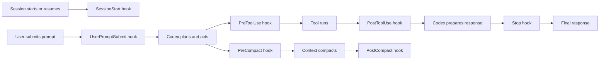

# Using Hooks with Codex

Hooks are local commands that Codex can run at specific points in its lifecycle.
They are useful for adding context, enforcing lightweight guardrails, and catching
workflow mistakes before they turn into expensive cleanup.

For this workshop, the mental model is simple: **prompts tell Codex what to do,
`AGENTS.md` tells Codex how this repository works, and hooks enforce or inject
small pieces of context at the right moment.**

This guide is written against `codex-cli 0.130.0`.

## The Mental Model

A hook is a command with three pieces:

- **Event:** when Codex should run it.
- **Matcher:** which tool or lifecycle source it should apply to, when the event supports matching.
- **Command:** the local script or shell command Codex should execute.

Codex sends the hook a JSON payload on standard input. The hook can ignore it,
log it, or emit structured JSON on standard output to influence the current
turn.



The best hooks are small, deterministic, and boring. They do one thing, they do
it quickly, and they produce a clear signal.

## When Hooks Help

Hooks are a good fit when you want Codex to remember or enforce a rule that is
easy to check mechanically.

Good hook candidates:

- Add current task context to every prompt from a local task file.
- Remind Codex which verification commands matter for this repository.
- Block `git commit --no-verify`, `git push --force`, or other bypass commands.
- Warn when Codex tries to edit generated files directly.
- Require tests after touching certain directories.
- Capture a compact summary of failed commands as additional context.
- Stop the turn when a required final gate has not run.

Poor hook candidates:

- Replacing tests, linting, or TypeScript.
- Running slow full-suite checks before every command.
- Mutating project files automatically in response to every prompt.
- Sending Slack messages, email, or external service requests without explicit
  user approval.
- Hiding important failures behind best-effort automation.

## Enable Hooks

Hooks are controlled by the `hooks` feature flag. Check whether it is enabled:

```bash
codex features list | rg '^hooks'
```

Enable hooks globally in `~/.codex/config.toml`:

```toml
[features]
hooks = true
```

You can also enable hooks for one Codex invocation:

```bash
codex --enable hooks
```

After adding or changing hooks, open the hook manager in the interactive Codex
interface:

```text
/hooks
```

The `/hooks` view lists installed lifecycle hooks, their source files, whether
they are enabled, and whether they need review. Codex stores enablement and
trusted command hashes under `hooks.state` in `config.toml`. If a hook command
changes, Codex can require another review before running it.

## Where Hooks Live

Codex discovers hooks from configuration layers. The two common places are:

- `~/.codex/hooks.json` for user-wide hooks.
- `.codex/hooks.json` in a trusted project for project-specific hooks.

Codex can also read hooks from the `hooks` table in `config.toml`, but use one
representation per layer. If a layer has both `hooks.json` and TOML hooks, Codex
will load both and warn that the layer should prefer a single representation.

For workshops, prefer this split:

- Put the feature flag and trusted hook state in `~/.codex/config.toml`.
- Put hook definitions in `~/.codex/hooks.json` or `.codex/hooks.json`.
- Put executable scripts in a stable directory such as `~/.codex/hooks/`.

Avoid putting shared hook scripts in temporary directories. If the hook path
disappears, Codex cannot run it, and students will be debugging environment
state instead of learning the workflow.

## Basic `hooks.json`

This is the smallest useful shape:

```json
{
  "hooks": {
    "UserPromptSubmit": [
      {
        "hooks": [
          {
            "type": "command",
            "command": "python3 /Users/you/.codex/hooks/add-store-pulse-context.py",
            "timeout": 5,
            "statusMessage": "Adding Store Pulse context"
          }
        ]
      }
    ],
    "PreToolUse": [
      {
        "matcher": "Bash",
        "hooks": [
          {
            "type": "command",
            "command": "python3 /Users/you/.codex/hooks/check-shell-command.py",
            "timeout": 5,
            "statusMessage": "Checking shell command"
          }
        ]
      }
    ]
  }
}
```

Each event maps to a list of matcher groups. Each matcher group has an optional
`matcher` and a `hooks` array. In current Codex builds, command hooks are the
supported handler type. `prompt` and `agent` hook handler types may appear in
schemas, but they are skipped by the runtime today. The `async` field may also
appear in examples from other ecosystems; asynchronous hooks are skipped in
current Codex builds.

The same hook can be expressed inline in `config.toml`:

```toml
[features]
hooks = true

[hooks]

[[hooks.PreToolUse]]
matcher = "Bash"

[[hooks.PreToolUse.hooks]]
type = "command"
command = "python3 /Users/you/.codex/hooks/check-shell-command.py"
timeout = 5
statusMessage = "Checking shell command"
```

Again, prefer `hooks.json` for the hook list unless you have a specific reason
to colocate hooks with the rest of `config.toml`.

## Hook Events

| Event | Matcher? | Runs when | Good uses |
| --- | --- | --- | --- |
| `SessionStart` | Yes | A Codex session starts, resumes, or clears | Session preflight, project context, environment checks |
| `UserPromptSubmit` | No | The user submits a prompt | Add task context, block malformed automation prompts |
| `PreToolUse` | Yes | Before a tool call executes | Block unsafe commands, enforce workflow rules |
| `PermissionRequest` | Yes | Before an approval request is shown or resolved | Allow or deny specific permission requests |
| `PostToolUse` | Yes | After a tool call completes | Add failure context, summarize important outputs |
| `PreCompact` | Yes | Before context compaction | Snapshot important state |
| `PostCompact` | Yes | After context compaction | Restore concise working context |
| `Stop` | No | Codex is about to finish the turn | Final gate reminders, continuation prompts |

Most workshop hooks should use `UserPromptSubmit`, `PreToolUse`, or
`PostToolUse`. Reach for `Stop` only when you need a final quality gate, because
a blocking stop hook asks Codex to continue instead of ending the turn.

## Matchers

Events with matchers compare the `matcher` value against an event-specific
input.

For tool events such as `PreToolUse`, `PermissionRequest`, and `PostToolUse`,
the matcher targets the tool name. Common examples include `Bash` and MCP tool
names such as `mcp__memory__create_entities`.

Matcher behavior:

- Omit `matcher` to match all occurrences of that event.
- Use `*` or an empty string to match all occurrences.
- Use exact names for simple tool matches, such as `Bash`.
- Use pipe-separated exact names for alternatives, such as `Bash|Edit`.
- Use regular expressions when you need pattern matching, such as
  `mcp__.*__write.*`.

Lifecycle matcher inputs:

- `SessionStart` uses `startup`, `resume`, or `clear`.
- `PreCompact` and `PostCompact` use the compaction trigger, such as `manual`
  or `auto`.
- `UserPromptSubmit` and `Stop` ignore matchers.

Keep matchers narrow. A hook that runs on every tool call becomes background
noise quickly.

## What Hooks Receive

Codex executes command hooks through the user shell. On macOS and Linux, that is
roughly:

```bash
$SHELL -lc '<hook command>'
```

The hook receives JSON on standard input and runs with the current working
directory set to the workspace directory.

Common fields include:

- `session_id`
- `turn_id` when the event is turn-scoped
- `transcript_path`
- `cwd`
- `hook_event_name`
- `model`
- `permission_mode`

Tool events also include tool-specific input and output fields. For a `Bash`
`PreToolUse` hook, the shell command is available under `tool_input.command`.

The safest way to learn a hook payload is to log the JSON during development:

```python
#!/usr/bin/env python3
import json
import pathlib
import sys

payload = json.load(sys.stdin)
log_path = pathlib.Path.home() / ".codex" / "hook-payloads.jsonl"
with log_path.open("a", encoding="utf-8") as handle:
    handle.write(json.dumps(payload, sort_keys=True) + "\n")
```

Remove noisy logging once the hook is stable.

## What Hooks Can Emit

A hook can emit nothing, plain text, or structured JSON.

Use this rule of thumb:

- Emit **nothing** when the hook only needs to allow the turn to continue.
- Emit **valid JSON** when the hook needs to add context, block work, or make a
  permission decision.
- Avoid plain text unless you intentionally want visible hook output.

Be careful with standard output. If output starts with `{` or `[`, Codex treats
it as JSON-shaped hook output. Invalid JSON-shaped output can turn a useful
guardrail into a confusing hook failure. Write diagnostic logs to a file instead
of standard output.

### Add Context

`SessionStart`, `UserPromptSubmit`, `PreToolUse`, and `PostToolUse` can add
context for Codex.

```json
{
  "hookSpecificOutput": {
    "hookEventName": "UserPromptSubmit",
    "additionalContext": "Store Pulse verification gates: npm run lint, npm run test, npm run build."
  }
}
```

Use added context for short, relevant facts. Do not dump large files or long
logs into every turn.

### Block Before a Tool Runs

`PreToolUse` can block a tool call. This older shape is still supported and is
easy to read:

```json
{
  "decision": "block",
  "reason": "Do not bypass hooks or commit checks with --no-verify."
}
```

The hook-specific shape is more explicit:

```json
{
  "hookSpecificOutput": {
    "hookEventName": "PreToolUse",
    "permissionDecision": "deny",
    "permissionDecisionReason": "Do not bypass hooks or commit checks with --no-verify."
  }
}
```

For `PreToolUse`, `deny` is the useful hook-specific decision. `allow` and `ask`
are not useful for this event in current Codex builds.

### Decide a Permission Request

`PermissionRequest` can allow or deny an approval request before the normal
approval flow continues.

```json
{
  "hookSpecificOutput": {
    "hookEventName": "PermissionRequest",
    "decision": {
      "behavior": "deny",
      "message": "Force pushes require explicit user confirmation in this workshop."
    }
  }
}
```

If multiple `PermissionRequest` hooks match, Codex folds them conservatively:
any denial wins; otherwise the last allow wins; otherwise the normal approval
flow continues.

### Block After a Tool Runs

`PostToolUse`, `UserPromptSubmit`, and `Stop` can return a block decision with a
reason.

```json
{
  "decision": "block",
  "reason": "The last test command failed. Diagnose the failure and rerun the verification gate before responding."
}
```

Use this sparingly. Blocking after every imperfect command can create loops. It
works best for high-confidence conditions such as "you are about to finish, but
the requested verification command has not run."

### Stop Processing

Most events support universal fields such as `continue`, `stopReason`,
`suppressOutput`, and `systemMessage`, but support varies by event. For example,
`PreToolUse` and `PermissionRequest` reject `continue: false`.

Prefer event-specific outputs unless you have verified the exact behavior for
the event you are using.

## Store Pulse Hook Ideas

These are deliberately modest examples that fit this repository.

### Add Repository Context

Use `UserPromptSubmit` to remind Codex of the Store Pulse commands and scope.

```json
{
  "hooks": {
    "UserPromptSubmit": [
      {
        "hooks": [
          {
            "type": "command",
            "command": "python3 /Users/you/.codex/hooks/store-pulse-context.py",
            "timeout": 5,
            "statusMessage": "Adding Store Pulse context"
          }
        ]
      }
    ]
  }
}
```

```python
#!/usr/bin/env python3
import json
import pathlib
import sys

payload = json.load(sys.stdin)
workspace = pathlib.Path(payload.get("cwd", ""))

if workspace.name != "store-pulse":
    raise SystemExit(0)

context = (
    "Store Pulse is a Next.js 16, Prisma, SQLite, Tailwind v4 workshop app. "
    "Use npm, keep database access in lib/, prefer pure helpers for unit-tested "
    "logic, and verify with npm run lint, npm run test, and npm run build."
)

print(json.dumps({
    "hookSpecificOutput": {
        "hookEventName": "UserPromptSubmit",
        "additionalContext": context,
    }
}))
```

This is intentionally short. It nudges Codex without replacing `AGENTS.md`.

### Block Verification Bypasses

Use `PreToolUse` on `Bash` to block commands that bypass checks.

```python
#!/usr/bin/env python3
import json
import re
import sys

payload = json.load(sys.stdin)
command = payload.get("tool_input", {}).get("command", "")

blocked_patterns = [
    (r"(^|\s)(git\s+commit|git\s+push)\b.*\s--no-verify(\s|$)", "Do not bypass git hooks with --no-verify."),
    (r"(^|\s)git\s+push\b.*\s--force(\s|$)", "Force pushes require explicit user confirmation."),
    (r"(^|\s)git\s+reset\s+--hard(\s|$)", "Destructive git resets require explicit user confirmation."),
]

for pattern, reason in blocked_patterns:
    if re.search(pattern, command):
        print(json.dumps({
            "decision": "block",
            "reason": reason,
        }))
        break
```

This hook is narrow, fast, and high-confidence. It does not try to parse every
possible shell command. It blocks the mistakes that matter most.

### Remind About Verification

Use `Stop` for final gates only when the rule is clear. For example, a workshop
hook could notice that source files changed and remind Codex to run the expected
checks before finalizing.

```json
{
  "hooks": {
    "Stop": [
      {
        "hooks": [
          {
            "type": "command",
            "command": "python3 /Users/you/.codex/hooks/store-pulse-stop-gate.py",
            "timeout": 5,
            "statusMessage": "Checking final gates"
          }
        ]
      }
    ]
  }
}
```

Keep this kind of hook conservative. It should block only when it has strong
evidence that Codex is about to finish without satisfying a requested or
repository-standard gate.

## Best Practices

**Start with observation.** Before blocking anything, write a hook that logs
payloads for a few runs. Learn the exact event shape, then add behavior.

**Keep hooks fast.** A hook runs in the middle of the user experience. Set an
explicit `timeout`, and aim for one to five seconds. Codex defaults to a much
larger `600` second timeout when none is provided, which is rarely what you want
for a workshop.

**Match narrowly.** Prefer `matcher = "Bash"` over a hook that runs for every
tool call. Prefer a specific MCP tool matcher over all MCP calls.

**Do not depend on hook ordering.** Multiple handlers for the same event may run
in parallel. If one hook needs another hook's result, combine that work into one
script or persist explicit state somewhere the second hook can safely read.

**Use absolute command paths.** A hook should not depend on whichever directory
Codex happens to run from. Put reusable scripts in a stable location and call
them with absolute paths.

**Keep standard output intentional.** Emit no output for "allow" cases. Emit
valid JSON for context or blocking. Write debugging details to a log file.

**Make failure messages actionable.** A block reason should tell Codex exactly
what to do next: "Run `npm run test` and fix the failure" is better than
"Invalid state."

**Do not mutate casually.** Hooks are best as readers and gatekeepers. If a hook
edits files, creates commits, or changes remote state, it becomes another actor
in the repository and makes the session harder to reason about.

**Avoid hidden network behavior.** A hook that posts to Slack, sends email,
creates issues, or calls an external API should require explicit user approval
outside the hook path.

**Prefer policy over cleverness.** Hooks should enforce clear local rules, not
infer broad intent. If a rule takes more than a paragraph to explain, it is
probably a prompt, an `AGENTS.md` instruction, a test, or a command script
instead.

**Review hook changes like code.** A hook can block commands, inject context,
and affect approvals. Treat changes to shared hooks as code changes with the
same review standard.

## Testing Hooks

Test the script before wiring it into Codex.

For a `UserPromptSubmit` hook:

```bash
printf '%s\n' '{"hook_event_name":"UserPromptSubmit","cwd":"/Users/you/Developer/store-pulse","prompt":"Add a feature"}' \
  | python3 /Users/you/.codex/hooks/store-pulse-context.py
```

For a `PreToolUse` hook:

```bash
printf '%s\n' '{"hook_event_name":"PreToolUse","tool_input":{"command":"git commit --no-verify -m test"}}' \
  | python3 /Users/you/.codex/hooks/check-shell-command.py
```

The second command should print a JSON block decision. A harmless command should
print nothing:

```bash
printf '%s\n' '{"hook_event_name":"PreToolUse","tool_input":{"command":"npm run test"}}' \
  | python3 /Users/you/.codex/hooks/check-shell-command.py
```

After the script works, add it to `hooks.json`, restart or refresh Codex, and
open `/hooks` to review and enable it.

## Workshop Recommendations

For Store Pulse, a good teaching setup is:

- One `UserPromptSubmit` hook that injects short repository-specific context.
- One `PreToolUse` hook that blocks bypass commands such as `--no-verify` and
  force pushes.
- Optional: one `Stop` hook that reminds Codex to run verification only when
  source files changed and no verification command appears in the recent turn.

Do not start with a large hook suite. Students should be able to understand
each hook in one screen. The goal is to demonstrate that Codex can be guided by
local, inspectable automation, not to build an invisible policy engine.

## Common Failure Modes

**The hook does not run.** Check `codex features list`, confirm that
`[features] hooks = true` is set, open `/hooks`, and verify the hook is enabled
and trusted.

**The hook needs review.** Open `/hooks` and review it. Codex tracks trusted
hashes for hook commands, so command changes can require another review.

**The hook blocks too much.** Narrow the matcher or make the script check for a
more specific condition.

**The hook output is confusing.** Make sure the script emits either no standard
output or valid JSON. Do not print debugging banners that start with `{` or `[`.

**The hook is slow.** Add or lower `timeout`, remove expensive work, or move the
check to a normal verification command.

**The hook depends on missing tools.** Prefer Python or shell scripts that use
the standard library. If a hook needs `jq`, `gh`, or another tool, check for it
and fail with a clear message.

## Completion Checklist

A hook setup is ready for workshop use when:

- `codex features list` shows `hooks` enabled.
- `/hooks` shows the expected hooks as enabled and trusted.
- Each hook script can be run manually with representative JSON.
- Allow cases emit no standard output.
- Block cases emit valid JSON with an actionable reason.
- Hook commands use stable absolute paths.
- Every hook has an explicit timeout.
- The setup is documented enough for students to inspect and modify it.
