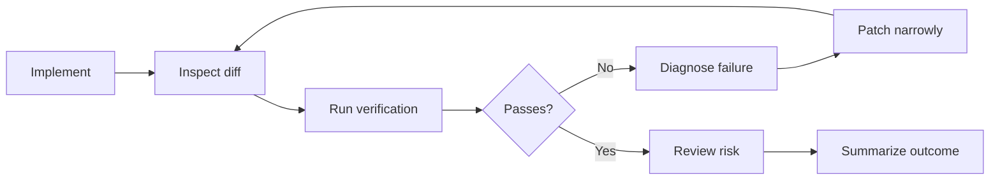

# Review and Verification with Codex

Implementation is not done when Codex stops typing. It is done when the diff is
understood, the right checks pass, and the remaining risk is explicit.

This guide covers the practical review loop for Store Pulse:

- Inspect what changed.
- Run the right verification commands.
- Diagnose failures from evidence.
- Ask Codex to tighten the patch.
- Stop only when the repository is in a known state.

## The Core Loop

Use this loop for every non-trivial change:



The loop is intentionally boring. That is the point. Boring verification catches
interesting mistakes.

## Start with `git status`

Before reviewing a change, get the file-level shape:

```bash
git status --short
```

Use it to answer:

- Which files changed?
- Are there untracked files?
- Did Codex touch files outside the requested scope?
- Are generated or local artifact files present?
- Is the working tree already dirty from unrelated work?

For Store Pulse, do not commit local database artifacts such as `prisma/dev.db`
or `prisma/test.db`.

## Inspect the Diff

Inside Codex, use:

```text
/diff
```

From the terminal, use:

```bash
git diff
```

If staged files exist:

```bash
git diff --staged
```

Ask Codex for a review before asking for more edits:

```text
Review the current diff. Focus on bugs, behavioral regressions, missing tests,
scope drift, and anything that conflicts with AGENTS.md. Do not edit files yet.
```

Good review questions:

- Does the diff solve the requested problem?
- Did it change unrelated behavior?
- Did it add tests at the right level?
- Did it follow existing project patterns?
- Did it preserve domain rules?
- Are there new edge cases?

Weak review questions:

- "Does this look good?"
- "Anything else?"
- "Can you polish it?"

Specific review prompts get specific findings.

## Store Pulse Verification Commands

Use the commands from `package.json`.

Fast everyday gate:

```bash
npm run lint
npm run test
```

Production build gate:

```bash
npm run build
```

End-to-end gate:

```bash
npm run test:e2e
```

Database setup and seed commands:

```bash
npm run setup
npm run db:seed
npm run db:reset
```

Use `db:reset` only when you intentionally want to rebuild the local database.

## Which Gate to Run

Run `npm run lint` when:

- Any TypeScript, React, or configuration file changed.
- Codex added imports.
- Codex refactored code.
- Codex touched formatting-sensitive code.

Run `npm run test` when:

- Any helper in `lib/` changed.
- Any domain behavior changed.
- A bug fix was made.
- A new pure calculation was added.

Run `npm run build` when:

- Any route file changed.
- Prisma schema or generated types changed.
- Next.js behavior might differ in production.
- TypeScript or module boundaries changed.

Run `npm run test:e2e` when:

- The dashboard flow changed.
- Navigation changed.
- The user-facing happy path changed.
- You need confidence that the app works in a browser.

For workshop timing, the usual minimum is `npm run lint` and `npm run test`.
Name any skipped gate explicitly.

## Test the Smallest Unit First

When a change adds logic, put that logic in a pure helper when practical.

Good Store Pulse examples:

- Reorder quantity calculation.
- Low-stock filtering.
- Task status grouping.
- Store health aggregation.
- Formatting behavior.

Pure helpers should be tested with Vitest in `tests/unit/`. They are faster,
more deterministic, and easier to debug than a full browser test.

Prompt pattern:

```text
Before changing the page, add or update a unit test for the pure calculation
logic. Make the test fail for the missing behavior, then implement the helper.
```

## Read Failures Carefully

When a command fails, do not immediately patch from instinct. First identify:

- The command that failed.
- The first useful error.
- The file and line number.
- Whether the failure is lint, type checking, unit behavior, build behavior, or
  environment setup.
- Whether the failure is in a file Codex touched.

Good prompt:

```text
npm run test failed. Diagnose the failing test from the output, inspect the
related implementation, and explain the mismatch before editing. Do not skip or
weaken the test.
```

If a command produces a lot of output, focus Codex:

```text
Use the first failing test as the starting point. Ignore later cascading errors
until the first failure is fixed.
```

## Fix Narrowly

A failed check is not permission to rewrite the feature.

Ask for a narrow patch:

```text
Fix only the failing lint issue. Do not refactor unrelated code.
```

Or:

```text
Fix the failing reorder quantity expectation by aligning the helper and test
with the domain rule. Do not change page rendering.
```

After the patch, rerun the failed command. If it passes, rerun the broader gate
that originally mattered.

## Ask Codex to Review Its Own Work

After verification passes, ask for a final self-review:

```text
Review the final diff against the original prompt and AGENTS.md. Look for scope
drift, missing tests, incorrect assumptions, and any files that should not be
included. Do not edit files unless you find a concrete issue.
```

This is not a replacement for human review. It is a cheap second pass that often
catches:

- Unused imports.
- Over-broad helper names.
- Missing edge cases.
- Accidentally changed copy.
- Tests that assert implementation details instead of behavior.

## Human Review Responsibilities

Codex can help inspect a diff, but the human still owns:

- Whether the feature is the right feature.
- Whether the user experience makes sense.
- Whether the domain behavior is correct.
- Whether the risk is acceptable.
- Whether to commit, push, or open a pull request.

Use Codex to reduce mechanical review burden. Do not outsource judgment.

## Review Checklist

Before calling a task done, confirm:

- `git status --short` shows only expected files.
- The diff matches the requested scope.
- New behavior has tests where practical.
- No tests were skipped or weakened to make the suite pass.
- No local database files or generated artifacts are included accidentally.
- No package manager switch occurred.
- `npm run lint` passed, or the failure is documented as a blocker.
- `npm run test` passed, or the failure is documented as a blocker.
- Any skipped `npm run build` or `npm run test:e2e` gate is named.
- The final response lists changed files and verification results.

## Done Signals

A good final response from Codex should include:

- What changed.
- Which files changed.
- Which verification commands ran.
- Whether those commands passed.
- Any remaining risk or skipped gate.

Example:

```text
Implemented reorder suggestions on the dashboard and store detail page. The
calculation lives in lib/inventory.ts with unit coverage in
tests/unit/inventory.test.ts.

Verification:
- npm run lint: passed
- npm run test: passed
```

Bad final response:

```text
Done.
```

## When Verification Fails Twice

After two failed attempts at the same fix, stop patching and re-diagnose.

Prompt:

```text
Stop making changes. We have tried two fixes and the same command still fails.
Re-read the failing output, inspect the relevant files, and explain the actual
root cause before proposing another patch.
```

Repeated failure usually means the mental model is wrong. More edits will
usually make the diff worse until the diagnosis improves.

## Pull Request Review

When reviewing a pull request, lead with findings:

- Bugs.
- Regressions.
- Missing tests.
- Unsafe assumptions.
- Behavior that conflicts with `AGENTS.md`.

Use file and line references when possible. Avoid a top-level "looks good"
comment when there are line-specific findings.

Prompt pattern:

```text
Review this pull request from a code-review stance. Prioritize correctness,
behavioral regressions, missing tests, and scope drift. Leave findings with file
and line references where possible.
```

## Store Pulse Feature Verification Map

Smart reorder suggestions:

- Unit test the reorder calculation.
- Run `npm run test`.
- Run `npm run lint`.
- Consider `npm run build` because dashboard and store pages render the result.

Incident timeline:

- Add a Prisma migration.
- Seed incidents.
- Run `npm run db:reset` or `npm run setup` in a clean local state.
- Run `npm run lint`, `npm run test`, and `npm run build`.
- Consider `npm run test:e2e` if the store detail path changes materially.

Operations assistant panel:

- Unit test deterministic helper responses.
- Run `npm run test`.
- Run `npm run lint`.
- Run `npm run build` for dashboard rendering.

Task completion changes:

- Unit test task helper behavior.
- Run `npm run test`.
- Run `npm run lint`.
- Run `npm run test:e2e` if the dashboard flow changes.

## Rule of Thumb

If Codex changed code, inspect the diff.

If Codex changed behavior, run tests.

If Codex changed pages, build the application.

If Codex changed a workflow users click through, run the browser test.

If a gate did not run, say so.
