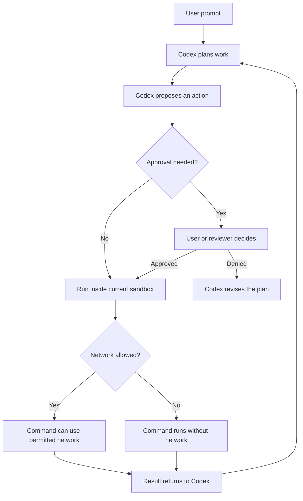

# Codex Safety Model

Codex is most useful when it can inspect the project, edit files, and run the
same checks a human would run. The safety model is what keeps that power scoped.

The short version:

- **Approvals:** decide when Codex needs permission before taking an action.
- **Sandboxing:** limits what commands can read, write, or execute against.
- **Network access:** controls whether commands can reach the internet or other
  network services.

Those controls are related, but they are not the same thing. Approving a command
does not rewrite the sandbox rules by itself. Running in a sandbox does not mean
every command is safe. Enabling web search does not automatically allow shell
commands to use the network.

This guide is written against `codex-cli 0.130.0`.

## The Mental Model

Think of Codex safety as a set of gates around each action.



The important separation is:

- **Approval is a decision point.** It asks whether the action should be allowed
  to proceed.
- **Sandboxing is an enforcement boundary.** It limits what the command can do
  even after it proceeds.
- **Network access is a capability.** It is either available to that command
  context or it is not.

## Approvals

Approvals answer one question: should Codex be allowed to do this action now?

Approval prompts are useful for actions with higher blast radius:

- Running a write command when Codex is in a restrictive mode.
- Escaping the sandbox.
- Accessing the network when network access is blocked.
- Calling an MCP tool that is configured to require confirmation.
- Performing operations that affect shared systems, credentials, or external
  services.

Approvals are not just a speed bump. When you approve, you are accepting that
specific action in the current context. Read the command, path, and reason before
approving.

## Approval Policies

You can set the approval policy with `config.toml`:

```toml
approval_policy = "on-request"
```

Or with a one-off command-line flag:

```bash
codex --ask-for-approval on-request
```

Supported approval policies:

- `untrusted`: only known safe read-only commands run without asking. Everything
  else asks first.
- `on-request`: Codex decides when it needs approval.
- `never`: Codex never asks. Failures are returned to Codex instead of being
  escalated to the user.

`on-failure` exists for older workflows, but it is deprecated. Prefer
`on-request` for interactive work and `never` only for controlled
non-interactive automation.

For most Store Pulse workshop work, use:

```toml
approval_policy = "on-request"
```

Use `untrusted` for read-heavy review or when you want Codex to ask before
almost anything with side effects.

Use `never` only when the environment is already safe enough for automation:
for example, a disposable worktree with a narrow sandbox and no production
credentials.

## What Approvals Are Not

Approvals are not a substitute for tests, linting, code review, or careful
scope control.

Approvals do not make a command correct. They only decide whether a command is
allowed to run.

Approvals do not automatically protect external systems. If you approve a
command that sends a Slack message, pushes code, deletes a branch, drops a
table, or changes a remote resource, Codex will try to do what you approved.

The best approval habit is simple: approve local, reversible work quickly, and
slow down on actions that are hard to undo.

## Sandboxing

Sandboxing answers a different question: once a command runs, what can it
touch?

Set the sandbox mode in `config.toml`:

```toml
sandbox_mode = "workspace-write"
```

Or for one invocation:

```bash
codex --sandbox workspace-write
```

Supported sandbox modes:

- `read-only`: Codex can inspect files, but commands cannot write inside the
  sandbox.
- `workspace-write`: Codex can write inside the current workspace and configured
  writable roots.
- `danger-full-access`: Codex runs without filesystem sandboxing.

For most implementation work, use:

```toml
sandbox_mode = "workspace-write"
approval_policy = "on-request"
```

That gives Codex enough room to edit Store Pulse, run `npm run test`, and update
documentation while keeping unrelated filesystem locations out of scope.

## Read-Only Mode

Use `read-only` when the job is investigation, review, or planning.

```toml
[profiles.review]
sandbox_mode = "read-only"
approval_policy = "untrusted"
model_reasoning_effort = "high"
```

Good uses:

- Review a pull request.
- Explain a code path.
- Inspect failing tests before deciding on a fix.
- Audit architecture or documentation.

Bad uses:

- Implement a feature.
- Run commands that need to write generated files.
- Install dependencies or update lockfiles.

Read-only mode is intentionally constraining. If Codex needs to modify files, it
should ask or you should switch to a write-capable profile.

## Workspace-Write Mode

Use `workspace-write` for normal development.

```toml
sandbox_mode = "workspace-write"

[sandbox_workspace_write]
writable_roots = ["/Users/you/Developer/store-pulse"]
network_access = false
exclude_tmpdir_env_var = true
exclude_slash_tmp = true
```

In this mode, Codex can write to the workspace and any additional writable
roots you configure. By default, temporary directories can also be writable
unless you exclude them.

Useful settings:

- `writable_roots`: additional directories Codex may write.
- `network_access`: whether commands may use outbound network access.
- `exclude_tmpdir_env_var`: remove `$TMPDIR` from default writable roots.
- `exclude_slash_tmp`: remove `/tmp` from default writable roots on Unix-like
  systems.

Best practice: keep writable roots small and explicit. If the task only needs
Store Pulse, do not add your whole `Developer` directory.

## Danger-Full-Access Mode

`danger-full-access` disables filesystem sandboxing.

```toml
sandbox_mode = "danger-full-access"
```

This mode is sometimes useful inside an external sandbox, disposable virtual
machine, or locked-down automation runner. It is the wrong default for a
workshop.

Avoid pairing `danger-full-access` with `approval_policy = "never"` unless the
entire surrounding environment is disposable and intentionally isolated.

Also avoid `--dangerously-bypass-approvals-and-sandbox` in workshops. It is
designed for environments that are already externally sandboxed, not for normal
local development.

## Network Access

Network access answers this question: can the command reach outside the local
machine?

In the default `read-only` and `workspace-write` sandbox policies, shell command
network access is off unless you enable it. That means commands like `npm
install`, `curl`, `npx playwright install chromium`, or package-manager calls
that fetch remote resources may fail or require approval.

For `workspace-write`, configure shell network access here:

```toml
sandbox_mode = "workspace-write"

[sandbox_workspace_write]
network_access = false
```

Set it to `true` only when the workflow genuinely needs shell network access:

```toml
[sandbox_workspace_write]
network_access = true
```

Best practice for Store Pulse:

- Keep `network_access = false` for normal feature work.
- Temporarily allow network access when installing dependencies or Playwright
  browsers.
- Prefer a one-off profile or invocation for network-heavy setup instead of
  making network access your permanent default.

Example setup profile:

```toml
[profiles.setup]
sandbox_mode = "workspace-write"
approval_policy = "on-request"
```

Run it with a one-off network override:

```bash
codex --profile setup -c 'sandbox_workspace_write.network_access=true'
```

## Web Search Is Separate

Codex web search is not the same as shell network access.

Enable live web search with:

```bash
codex --search
```

Or configure it:

```toml
web_search = "cached"

[tools.web_search]
context_size = "medium"
allowed_domains = ["developers.openai.com"]
```

Supported web search modes:

- `disabled`
- `cached`
- `live`

When live web search is enabled, the model can use the web search tool without
per-call approval. That does not automatically mean shell commands can reach the
network.

The inverse is also true: allowing shell network access does not force Codex to
use live web search.

Use web search for current documentation, release notes, API behavior, and facts
that may have changed. Use shell network access for commands that must fetch
packages, download browsers, call services, or run integration tooling.

## MCP And External Tools

MCP servers, app connectors, and plugins can have their own approval surfaces.
They are part of the safety model because they often touch systems beyond the
local repository.

For MCP servers, prefer prompt-based approval by default:

```toml
[mcp_servers.local_tasks]
command = "/Users/you/.local/bin/tasks-mcp"
args = ["--cwd", "/Users/you/Developer/store-pulse"]
default_tools_approval_mode = "prompt"
enabled_tools = ["tasks/list", "tasks/read"]
```

Useful MCP guardrails:

- `enabled_tools`: expose only the tools the workflow needs.
- `disabled_tools`: hide risky or irrelevant tools.
- `default_tools_approval_mode = "prompt"`: ask before tool calls.
- `enabled = false`: keep a server registered but unavailable.

Best practice: start with read tools. Add write tools only when the lesson or
workflow needs them.

## Recommended Store Pulse Defaults

For normal workshop development:

```toml
approval_policy = "on-request"
sandbox_mode = "workspace-write"
web_search = "cached"

[sandbox_workspace_write]
network_access = false
exclude_tmpdir_env_var = true
exclude_slash_tmp = true

[features]
hooks = true
plugins = true
tool_search = true
```

This setup lets Codex edit the repository and run local checks while asking
before higher-risk actions.

For review-only work:

```toml
[profiles.review]
approval_policy = "untrusted"
sandbox_mode = "read-only"
model_reasoning_effort = "high"
```

For setup work that needs package downloads:

```toml
[profiles.setup]
approval_policy = "on-request"
sandbox_mode = "workspace-write"
```

Run setup with network access enabled for that invocation:

```bash
codex --profile setup -c 'sandbox_workspace_write.network_access=true'
```

## Safety Prompts

Prompts can reinforce the safety model. They should tell Codex what is allowed,
what requires confirmation, and what verification proves the task is done.

Good prompt language:

```text
Inspect the existing codebase first. You may edit files and run local commands
inside this repository. Ask before installing packages, using the network,
pushing code, deleting files, or changing anything outside the workspace.
After implementation, run npm run lint and npm run test.
```

For review:

```text
Review the current changes without editing files. Focus on bugs, regressions,
missing tests, and unsafe assumptions. Do not run commands that write files.
```

For setup:

```text
This setup task may require network access to install dependencies and
Playwright browsers. Ask before making any destructive changes or modifying
files outside this repository.
```

## Approval Checklist

Before approving an action, check:

- Does the command match the task I asked for?
- Is it operating inside the expected repository?
- Could it delete, overwrite, publish, send, or push something?
- Does it need network access, and is that expected?
- Is there a simpler local or reversible action that would work instead?

Approve quickly when the action is local, expected, and reversible. Slow down
when the action affects external systems, credentials, git history, databases,
or shared infrastructure.

## Best Practices

Use `workspace-write` plus `on-request` for normal implementation work.

Use `read-only` plus `untrusted` for review, exploration, and teaching the
planning phase.

Keep shell network access off by default. Enable it only for setup, dependency
installation, browser installation, or explicit integration work.

Treat web search and shell network access as separate capabilities. Enable the
one the task actually needs.

Keep MCP tool surfaces narrow. Start with read-only tools, then add write tools
deliberately.

Do not use bypass flags in workshop material. If a task requires bypassing the
safety model, the environment should be redesigned before the lesson depends on
it.

Use profiles for different safety postures instead of rewriting the same
settings repeatedly.

Write prompts that define completion and failure conditions. Codex can
self-correct more reliably when it knows which commands are the gate.

Remember that local reversible work is low-risk, but shared systems are not.
Editing a file and running `npm run test` is routine. Pushing code, posting a
message, changing credentials, or deleting data needs explicit intent.
