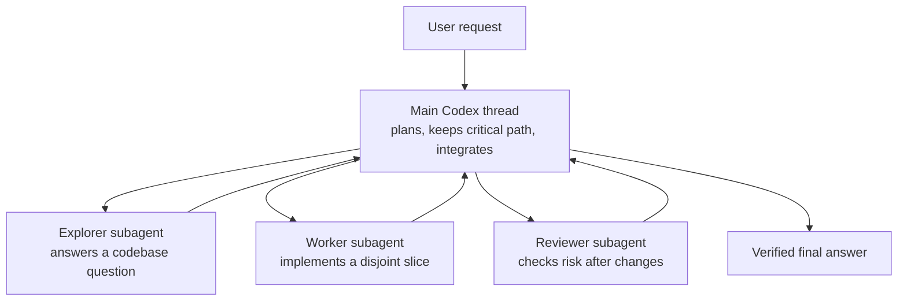

# Codex Subagents

Subagents let Codex split a task into smaller agent threads. They are useful
when a task has independent pieces that can run in parallel, or when a
specialist reviewer can catch problems while the main thread keeps moving.

They are not magic parallelism. A subagent is still another agent working from
instructions, context, tools, and files. The quality of the result depends on
whether the parent thread gives it a clear, bounded job.

This guide was written against `codex-cli 0.130.0`. Exact subagent role names
and feature flags can vary by installation, but the workflow principles hold.

## The Mental Model

Think of the main Codex thread as the lead engineer for the task.

The main thread should:

- Understand the full request.
- Decide what must happen on the critical path.
- Delegate only independent side work.
- Integrate results.
- Run final verification.
- Explain the final state to the user.

A subagent should:

- Own one bounded question or implementation slice.
- Avoid overlapping with other agents.
- Return a concise result the parent can verify.
- Stop when its assigned scope is complete.



The important point: **subagents help the lead thread make progress; they do
not replace the lead thread's judgment**.

## Ask Explicitly

Codex should only use subagents when the user explicitly asks for subagents,
delegation, or parallel agent work.

If you want subagents, say so:

```text
Use subagents where they help. Before spawning them, identify which work can run
in parallel and which work must stay on the critical path.
```

```text
Use up to three subagents. Give each one a concrete, non-overlapping task. Keep
the main thread responsible for integration and final verification.
```

If you do not mention subagents, a request for "deep analysis", "thorough
research", or "look carefully" is not enough by itself. Codex should do that
work locally unless you authorize delegation.

## What Codex Does Automatically

When subagents are enabled and Codex chooses to delegate, Codex handles several
mechanics for you:

| Codex behavior | What it means |
| --- | --- |
| Creates a separate agent thread | The subagent gets its own task and response stream. |
| Tracks agent identity | Codex can refer back to a spawned agent by its identifier or task name. |
| Inherits the default model | Spawned agents normally inherit the parent model unless a role or explicit override says otherwise. |
| Uses the available tool surface | Spawned agents generally receive the same available tools, with role and configuration limits applied. |
| Passes selected context | Codex can start the agent with a fresh prompt or fork the current conversation context when needed. |
| Sends follow-up messages | Codex can message a running agent, optionally interrupting it for an urgent correction. |
| Waits for results | Codex can wait for one or more agents when their output is needed. |
| Surfaces completion | Finished agents return a final status and may include their final answer. |
| Lets you switch threads | `/agent` opens the agent-thread picker in interactive Codex. |
| Can close agents | Codex can close agents that are no longer needed so they do not keep running. |

Codex also uses the current workspace, permission profile, available tools, and
repository instructions to shape what the subagent can do.

> [!NOTE]
> If subagents are disabled in a Codex installation, the interactive interface
> can prompt to enable them for the next session. You can also inspect feature
> state with `codex features list`.

## What Codex Does Not Do Automatically

Subagents do not remove the need for engineering discipline.

Codex does not automatically:

- Know which work is safe to parallelize.
- Prevent two agents from making incompatible design decisions.
- Guarantee that two implementation agents avoid the same files.
- Verify that a subagent's answer is correct.
- Merge code safely without conflicts.
- Run final project gates unless the parent asks for or performs them.
- Create Git worktrees for each subagent.
- Commit, push, or open a pull request unless explicitly authorized.
- Make nested delegation a good idea just because it is possible.

The parent thread still needs to review the result and run the real gates.

## Subagents, Worktrees, Forks, and Side Conversations

These are different tools:

| Tool | Use it for | It does not do |
| --- | --- | --- |
| **Subagent** | Parallel codebase work, specialist review, independent investigation, bounded implementation slices. | Automatically create Git isolation or make decisions safe. |
| **Git worktree** | Filesystem isolation for branches, experiments, cloud patches, and parallel local sessions. | Provide a separate thinking agent by itself. |
| **`/fork` or `codex fork`** | Branching conversation history to try a different reasoning path. | Create a Git branch, worktree, or parallel worker. |
| **`/side`** | Quick side questions that should not derail the main thread. | Run a full delegated implementation workflow. |
| **Codex Cloud task** | Remote task execution and cloud-generated diffs. | Replace local review, integration, or verification. |

For serious parallel implementation, combine tools intentionally: use Git
worktrees for filesystem isolation and subagents for bounded delegated work
inside a session.

## The Critical Path Rule

Before using subagents, Codex should identify the critical path.

**Critical path:** The next piece of work the main task cannot proceed without.

Keep critical-path work local when:

- The next edit depends on the answer.
- The task requires project-wide design judgment.
- The files are tightly coupled.
- A wrong answer would cause most of the implementation to go in the wrong
  direction.

Delegate side work when:

- The result can arrive later without blocking the main thread.
- The task is easy to specify and verify.
- The work has a clear output shape.
- The file ownership is disjoint from the main thread or other subagents.
- The result materially improves the main task.

Good delegation is not "make someone else do the hard part." Good delegation is
"keep the lead thread moving while a bounded side task runs."

## Good Subagent Tasks

Subagents work well for:

- **Read-only codebase exploration:** "Find every route that reads inventory
  data and summarize the data flow."
- **Specialist review:** "Review this diff for security issues involving user
  input and file paths."
- **Test design:** "Identify the regression tests needed for this helper and
  return specific test cases."
- **Disjoint implementation:** "Implement the pure calculation helper and unit
  tests. Do not touch UI files."
- **Documentation review:** "Review this Markdown guide for outdated command
  references and unclear sections."
- **Log triage:** "Read this CI log and identify the first failing command and
  the responsible file."
- **UI audit:** "Check the modified component for responsive layout and
  accessibility issues."

The common shape is clear: one input, one scope, one output.

## Bad Subagent Tasks

Subagents are a poor fit for:

- "Implement this whole feature" when the feature spans schema, data loading,
  UI, tests, and migration decisions.
- "Figure everything out" with no output structure.
- "Refactor the app" with no file boundaries.
- "Fix whatever you find" while other agents are editing the same files.
- "Run the final verification" while the parent is still changing code.
- "Choose the product direction" when the main thread should ask the user.
- "Commit and push" unless the user explicitly authorized that action.

If a task cannot be verified independently, it is usually not a good subagent
task.

## Choosing Agent Roles

Available roles depend on the Codex installation. In this environment, common
roles include:

| Role | Use it when |
| --- | --- |
| `explorer` | You need a specific read-only answer about the codebase. |
| `worker` | You want a bounded code change with clear file ownership. |
| `testing-expert` | You need test coverage, mocking strategy, or flaky test debugging. |
| `pr-reviewer` | You want a diff reviewed for correctness, regressions, and missing tests. |
| `security-reviewer` | The change touches user input, external commands, paths, authentication, or secrets. |
| `typescript-expert` | The task depends on advanced TypeScript types or API typing. |
| `frontend-architect` | The task involves frontend architecture, rendering strategy, performance, or accessibility. |
| `ux-designer` | The task needs interface, interaction, or responsive layout judgment. |
| `simplicity-engineer` | A plan or refactor may be over-engineered. |
| `junior-engineer` | A plan needs ambiguity and edge-case review before implementation. |
| `log-analyzer` | You have a large failure log or stack trace. |
| `product-manager` | You need feature scope, prioritization, or acceptance criteria. |

Pick the lightest role that can do the job. A specialist role is helpful only
when the specialization matches the task.

## Role Selection Examples

For a Store Pulse feature:

| Situation | Better role | Why |
| --- | --- | --- |
| "Where is low-stock logic calculated?" | `explorer` | Read-only codebase question. |
| "Add a pure reorder calculation helper and unit tests." | `worker` | Bounded implementation with a narrow write scope. |
| "Are these tests enough for inactive products and closed stores?" | `testing-expert` | Test coverage and edge cases. |
| "Does this Prisma schema migration match the feature?" | `pr-reviewer` | Change review against implementation intent. |
| "Could the assistant panel expose unsafe user input?" | `security-reviewer` | Security-specific concern. |
| "Is this dashboard panel too complex for a workshop demo?" | `simplicity-engineer` | Scope and complexity review. |

Do not pick a role because the name sounds impressive. Pick it because it
matches the output you need.

## Designing a Delegated Task

A good delegated task has five parts:

- **Goal:** The specific outcome.
- **Context:** The minimum project context the subagent needs.
- **Scope:** Files, directories, or behavior it owns.
- **Boundaries:** What it must not touch or decide.
- **Output:** The exact shape the parent needs back.

Use this template:

```text
Use a subagent for this bounded task.

Goal:
Find where Store Pulse computes low-stock inventory and summarize the data flow.

Scope:
Read `lib/`, `app/`, and existing unit tests. Do not edit files.

Questions to answer:
- Which helper owns low-stock filtering?
- Which routes or components consume that result?
- Which tests pin the inactive-product and closed-store behavior?

Output:
Return a concise summary with file paths and any risk areas. Do not propose a
large refactor.
```

For implementation work, add write ownership:

```text
Use a worker subagent for this bounded implementation slice.

Goal:
Add a pure helper for suggested reorder quantity and focused unit tests.

Write scope:
- `lib/reorder-suggestions.ts`
- `tests/unit/reorder-suggestions.test.ts`

Read scope:
- `lib/metrics.ts`
- `tests/unit/metrics.test.ts`
- `prisma/schema.prisma`

Boundaries:
Do not edit routes, components, Prisma schema, seed data, or package
configuration. You are not alone in the codebase, so do not revert changes made
by others.

Verification:
Run the relevant unit test if possible. If not possible, report the exact
blocker.

Output:
List changed files, behavior added, test results, and any integration notes.
```

The more specific the delegated task, the easier it is to trust and integrate.

## Forking Context

Codex can start a subagent with a fresh task prompt or fork the current thread
history into the subagent.

Use forked context when:

- The subagent needs the exact decisions already made in the conversation.
- The task depends on constraints the user gave earlier.
- Re-explaining the context would be longer and more error-prone than forking.

Avoid forked context when:

- The task is a simple read-only investigation.
- The current conversation is long and noisy.
- The subagent only needs file paths and a concrete question.
- You want the subagent to challenge the parent thread's assumptions.

Forking context can carry useful decisions, but it can also carry stale
assumptions. For many subagents, a clean, explicit prompt is better.

## Model and Reasoning Overrides

Spawned agents normally inherit the parent model. That is usually the right
default.

Override model or reasoning effort only when:

- The user explicitly asks for a different model.
- The task has a clear need, such as deep TypeScript type reasoning or fast log
  triage.
- A specialist role already defines its own model and reasoning settings.

Avoid model changes as a reflex. The larger gain usually comes from a better
task boundary, not a different model.

## Parallel Implementation

Parallel implementation only works when write scopes do not overlap.

Good split:

```text
Main thread:
- Inspect the existing Store Pulse data model and decide the implementation
  shape.
- Integrate returned changes.
- Run final verification.

Worker A:
- Own `lib/reorder-suggestions.ts`.
- Own `tests/unit/reorder-suggestions.test.ts`.
- Do not touch UI files.

Worker B:
- Own the dashboard rendering change.
- Do not touch calculation logic or tests.

Reviewer:
- After both workers finish, review the combined diff for regressions and
missing tests.
```

Risky split:

```text
Worker A:
Implement reorder suggestions.

Worker B:
Update the dashboard and store page.

Worker C:
Add tests wherever needed.
```

The risky version hides ownership. All three agents might edit the same helper,
same route, or same test file.

## Synchronization Points

Every parallel plan needs synchronization points.

Useful synchronization points:

- **Before editing:** Confirm worktree, branch, current diff, and file
  ownership.
- **After first implementation slice:** Parent reviews whether the shape still
  matches the plan.
- **Before final integration:** Parent checks for overlapping edits or
  incompatible assumptions.
- **Before final answer:** Parent runs verification gates and summarizes the
  actual final state.

Avoid waiting by reflex. If a subagent is running and the parent has meaningful
non-overlapping work, the parent should keep moving.

## Waiting and Messaging

Codex can wait for subagents, but waiting is not free. The parent thread should
wait only when it needs the result to continue.

Good waiting behavior:

- Spawn independent agents.
- Continue local work on a non-overlapping slice.
- Wait when a result becomes necessary.
- Review the result.
- Integrate or reject it.
- Close agents that are no longer needed.

Poor waiting behavior:

- Spawn a subagent for the next blocking step.
- Immediately wait.
- Do no local work.
- Accept the result without verification.

If a subagent is doing the wrong thing, message it with a correction. Use
interrupting only for urgent redirects; otherwise, send a normal queued
follow-up.

## Reviewing Subagent Output

Treat subagent output as a pull request from a teammate.

Review it for:

- Does it answer the assigned question?
- Did it stay inside scope?
- Did it touch only owned files?
- Did it preserve repository conventions?
- Did it add or update tests when behavior changed?
- Did it report verification honestly?
- Did it surface blockers instead of guessing?

Do not blindly trust a subagent because it sounds confident. The parent thread
owns integration.

## Verification

Subagents can run focused checks, but the parent should run the final gates.

For Store Pulse, final gates usually include:

```bash
npm run lint
npm run test
npm run build
```

Use the end-to-end test when behavior touches browser flows:

```bash
npm run test:e2e
```

For documentation-only changes, a lighter verification pass is reasonable:

```bash
git diff --check
```

When a subagent reports it could not run a command, the parent should decide
whether to run it, diagnose the blocker, or document the limitation.

## Store Pulse Examples

### Smart Reorder Suggestions

Good subagent plan:

```text
Use up to two subagents.

Keep the main thread responsible for reading the current dashboard and store
detail data flow, choosing the implementation shape, and integrating changes.

Spawn one explorer to answer:
- Where are low-stock inventory items calculated?
- Which tests cover inactive products and closed stores?
- Which files will likely need UI changes?

Spawn one testing-expert after the implementation shape is chosen to identify
the unit test cases for reorder quantity calculation.

Do not spawn implementation workers until file ownership is clear.
```

Why this works: the explorers return information that does not block the main
thread from reading adjacent files, and the testing specialist can run in
parallel with implementation planning.

### Incident Timeline

Better local work:

```text
Do not parallelize the Prisma schema and migration decision. Keep that in the
main thread.
```

Possible subagent use:

```text
Use one explorer subagent to inspect the existing store detail page and summarize
how related data is loaded and rendered. Read only. Return file paths and
integration points.
```

Why this works: schema changes are centralized and easy to get wrong, but a
read-only page-flow investigation is safe to delegate.

### Operations Assistant Panel

Good split:

```text
Use two subagents if the file ownership can stay disjoint.

Worker A:
Own a deterministic operations-assistant helper in `lib/` and its unit tests.
Do not touch UI files.

Worker B:
After the helper interface is clear, own the dashboard panel UI. Do not change
assistant logic.

Main thread:
Define the helper contract, integrate both slices, and run final gates.
```

Why this works: deterministic helper logic and presentation can be separated if
the interface is agreed up front.

## Prompt Patterns

### Read-Only Exploration

```text
Use an explorer subagent to answer this codebase question. It should not edit
files.

Question:
Where does the dashboard get the data for low-stock inventory, active tasks,
and store health?

Output:
Return the relevant files, functions, and tests. Keep it under 20 lines and
include any behavior rules that look easy to break.
```

### Bounded Worker

```text
Use a worker subagent for one implementation slice.

Ownership:
The worker owns `lib/operations-assistant.ts` and
`tests/unit/operations-assistant.test.ts`.

Task:
Create deterministic assistant response logic for predefined operational
questions using existing dashboard, inventory, task, and store data shapes.

Boundaries:
Do not edit routes, components, Prisma schema, seed data, or package
configuration. Do not call an external AI API. You are not alone in the
codebase, so do not revert changes made by others.

Output:
List changed files, exported functions, covered questions, and verification
commands run.
```

### Specialist Review

```text
Use a pr-reviewer subagent to review the current diff for correctness,
regressions, and missing tests. It should read surrounding code, not just the
diff. It should not edit files.

Output:
Findings first, ordered by severity, with file and line references. If there are
no blockers, say that clearly and name any residual risk.
```

### Security Review

```text
Use a security-reviewer subagent to scan this change for concrete exploitable
patterns. Focus on user input, file paths, external commands, unsafe rendering,
and secrets. It should not edit files.

Output:
Report only findings with file and line references. If no exploitable issues
are found, say what categories were checked.
```

### Plan Review

```text
Use a junior-engineer subagent to review this implementation plan before any
code changes. The goal is to find missing requirements, ambiguous acceptance
criteria, and edge cases.

Output:
Return must-fix gaps first, then optional clarifications. Do not rewrite the
plan unless a replacement sentence is needed.
```

## Anti-Patterns

### Too Many Agents

Bad:

```text
Use as many subagents as possible to build this feature quickly.
```

Better:

```text
Use at most two subagents. Only delegate work that is independent and has a
clear output. Keep the main thread responsible for integration.
```

More agents increase coordination cost. Use the fewest agents that create real
parallel progress.

### Vague Delegation

Bad:

```text
Have a subagent investigate the codebase.
```

Better:

```text
Use an explorer subagent to find every function that filters inventory by stock
level. Return file paths, function names, and tests that cover that behavior.
Do not edit files.
```

### Overlapping Write Scopes

Bad:

```text
Worker A updates dashboard metrics.
Worker B updates dashboard low-stock UI.
Worker C updates dashboard tests.
```

Better:

```text
Worker A owns the pure helper and unit tests.
Worker B owns the dashboard component after the helper interface is fixed.
Main thread owns integration and any shared route edits.
```

### Premature Waiting

Bad:

```text
Spawn a subagent to decide the first implementation step, then wait for it.
```

Better:

```text
Main thread reads the key files and chooses the implementation shape. Spawn a
subagent to inspect tests or review edge cases while the main thread continues.
```

### Delegating Final Responsibility

Bad:

```text
Have a subagent run final verification and tell me if it is done.
```

Better:

```text
Use a subagent for focused review, then have the main thread run final
verification and summarize the actual result.
```

## Custom Subagents

If you repeatedly need the same kind of specialist, write a custom subagent
definition instead of repeating long prompts.

Good custom subagents have:

- **One role:** A focused job, not a department.
- **Router-style description:** When to use it and what task shape it handles.
- **Minimal tools:** Read-only agents should stay read-only.
- **Concrete workflow:** What to inspect first, second, and third.
- **Output contract:** The exact format the parent can integrate.
- **Calibration:** Specific checks and examples, not generic advice.

A typical Codex agent definition looks like this:

```toml
name = "store-pulse-metrics-reviewer"
description = "Reviews Store Pulse metric and inventory changes for domain-rule regressions, especially inactive products, closed stores, and maintenance stores."
model = "gpt-5.3-codex-spark"
model_reasoning_effort = "low"
sandbox_mode = "read-only"
developer_instructions = '''
You review Store Pulse metric changes. Read the diff and surrounding helpers.
Focus on whether inactive products, closed stores, and maintenance stores keep
their documented semantics. Return blockers first with file and line references.
Do not edit files.
'''
```

Do not create a custom subagent just to avoid writing a clear prompt once. Create
one when the workflow is repeated enough that a durable specialist improves
quality.

## Subagent Checklist

Before spawning:

- Did the user explicitly authorize subagents or delegation?
- What is the critical path?
- What will the main thread do locally while the subagent runs?
- Is the delegated task self-contained?
- Is the output mechanically useful?
- Are write scopes disjoint?
- Does the subagent need conversation history, or is a fresh prompt better?

While agents are running:

- Keep the main thread moving on non-overlapping work.
- Avoid repeated waits.
- Message agents only when the correction matters.
- Do not duplicate delegated work locally.

After agents return:

- Review the result.
- Integrate deliberately.
- Check for overlapping edits.
- Run verification gates.
- Close agents that are no longer needed.
- Report what changed and what was verified.

## Workshop-Friendly Starter Prompt

Use this when you want participants to practice subagent delegation without
creating chaos:

```text
Use subagents where they help, but keep the main thread responsible for the
critical path, integration, and final verification.

Before spawning any subagents:
- Inspect the current codebase enough to identify the likely files.
- Explain which parts can run in parallel and which parts must stay local.
- Use at most two subagents.

For each subagent:
- Give it one bounded task.
- Define whether it is read-only or allowed to edit files.
- If it edits files, give it an explicit write scope.
- Tell it not to revert changes made by others.
- Require it to list changed files, verification run, and blockers.

After subagents return:
- Review their work.
- Integrate or revise as needed.
- Run `npm run lint`, `npm run test`, and `npm run build`.
- Report the final changed files and verification results.
```

## The Rule of Thumb

Use subagents when they create real parallel progress or bring a specialist lens
to a bounded task.

Do not use them to outsource thinking, avoid reading the codebase, or create the
appearance of progress. The main thread still owns the outcome.
