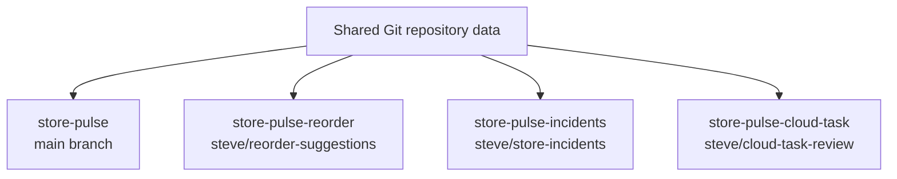

# Git Worktrees with Codex

Git worktrees let one repository have multiple working directories at the same
time. Each working directory can have its own branch, local files, running
development server, and Codex session.

That makes worktrees a natural fit for Codex: you can give Codex a contained
place to work without mixing experiments, pull request fixes, workshop demos,
or cloud-generated patches into your primary checkout.

This guide was written against `codex-cli 0.130.0` and the current Store Pulse
repository conventions.

## The Mental Model

A normal checkout gives you one working directory:

```text
store-pulse/
```

A worktree setup gives you several working directories that share the same Git
object database:



Each directory has its own checked-out files. A change in
`store-pulse-reorder` does not appear in `store-pulse-incidents` unless you
commit, merge, rebase, cherry-pick, or apply a patch.

The practical rule is simple: **one task, one branch, one worktree, one Codex
session**.

## When to Use a Worktree

Use a worktree when isolation matters:

- You want Codex to implement a feature while your main checkout has unrelated
  changes.
- You want to try two different implementations of the same prompt.
- You want one Codex session fixing tests while another explores a separate
  feature.
- You want to review or repair a pull request without disturbing the current
  checkout.
- You want to apply a Codex Cloud diff somewhere safe before deciding whether
  to keep it.
- You want a clean baseline for `npm run lint`, `npm run test`, or
  `npm run build`.

Skip a worktree for tiny documentation edits or one-line changes when the
current checkout is already clean and you are not running parallel work.

## What Codex Does Automatically

Codex is worktree-aware because it works from the current directory. If you
start Codex in a worktree, that worktree becomes the workspace Codex reads,
edits, tests, and reviews.

Codex automatically does several useful things:

| Codex behavior | What it means in a worktree |
| --- | --- |
| Uses the current working directory | `codex -C ../store-pulse-reorder` makes that worktree the workspace root. |
| Loads repository instructions | Codex reads the applicable `AGENTS.md` instructions for the selected workspace. |
| Tracks session metadata | Codex records session context such as working directory and branch when available. |
| Shows repository state | `/status` reports the active session state, including the working directory. |
| Shows the local diff | `/diff` shows the current Git diff for that worktree, including untracked files. |
| Reviews local changes | `/review` reviews staged, unstaged, and untracked files in the current worktree. |
| Detects branch context | The Codex terminal interface can show current branch, open pull request number, and committed branch diff statistics when Git and `gh` can provide them. |
| Preserves user changes by instruction | Codex is instructed to treat dirty worktrees carefully and not revert changes it did not make. |
| Applies cloud diffs to the current directory | `codex apply <task-id>` and `codex cloud apply <task-id>` apply the selected diff to the current local working tree. |
| Defaults cloud tasks to the current branch | `codex cloud exec --env <environment>` uses the current branch when it can detect one, unless you pass `--branch`. |

The key detail is that **current directory is the boundary**. If you start Codex
in the wrong worktree, Codex will faithfully inspect and edit the wrong place.

## What Codex Does Not Do Automatically

Codex does not turn every session into a Git worktree.

These are still your responsibility unless you explicitly ask Codex to do them:

- Create a worktree.
- Create a branch.
- Check out the correct base branch.
- Install dependencies in a fresh worktree.
- Create `.env` or local database files.
- Commit changes.
- Push a branch.
- Open, merge, or close a pull request.
- Prevent two terminals from running conflicting Git commands in the same
  worktree.
- Decide whether a cloud task diff deserves a permanent branch.

Also, `codex fork` and `/fork` fork the **conversation**, not the Git checkout.
They are useful for trying a different prompt or preserving a conversation
branch, but they do not create a Git branch or a Git worktree.

## Basic Workflow

Start by inspecting the existing worktrees:

```bash
git worktree list
```

Fetch the latest remote state before creating a branch:

```bash
git fetch origin
```

Create a new worktree from `origin/main`:

```bash
git worktree add ../store-pulse-reorder -b steve/reorder-suggestions origin/main
```

Move into the worktree:

```bash
cd ../store-pulse-reorder
```

Confirm the branch and status:

```bash
git branch --show-current
git status --short
```

Start Codex in that directory:

```bash
codex
```

Or start Codex from anywhere and point it at the worktree:

```bash
codex -C ../store-pulse-reorder
```

For non-interactive work:

```bash
codex -C ../store-pulse-reorder "Add smart reorder suggestions to the dashboard and include unit tests."
```

## Store Pulse Setup in a Fresh Worktree

Worktrees share Git history, but they do not share untracked files such as
`node_modules`, `.env`, `prisma/dev.db`, or `prisma/test.db`.

For Store Pulse, use `npm`, not Bun:

```bash
npm install
```

The `postinstall` hook runs setup when `.env` is missing. It copies
`.env.example`, generates Prisma, applies migrations, and seeds the local
SQLite database.

If you need to run setup manually:

```bash
npm run setup
```

After setup, these are the normal quality gates:

```bash
npm run lint
npm run test
npm run build
```

Use the end-to-end test when the change touches navigation, route rendering, or
browser behavior:

```bash
npm run test:e2e
```

Do not commit `.env`, `prisma/dev.db`, `prisma/test.db`, or generated local
state.

## Naming Worktrees

Use names that make the task obvious from a terminal tab, Finder window, or
Codex session picker:

```text
store-pulse-reorder
store-pulse-incidents
store-pulse-assistant
store-pulse-cloud-task-1234
store-pulse-pr-42
```

Use matching branch names:

```text
steve/reorder-suggestions
steve/store-incidents
steve/operations-assistant
steve/cloud-task-1234
steve/pr-42-review
```

Git only allows a normal branch to be checked out in one worktree at a time. If
you see an error that a branch is already checked out somewhere else, either
use that existing worktree, remove it after confirming it is safe, or create a
different branch.

## Pairing Worktrees with Codex Sessions

The cleanest pattern is to start one Codex session per worktree:

```bash
codex -C ../store-pulse-reorder
codex -C ../store-pulse-incidents
codex -C ../store-pulse-assistant
```

Inside each session, ask Codex to verify its local context before editing:

```text
Before making changes, inspect the current working directory, branch, git status,
and relevant project files. Then implement the feature in this worktree only.
```

That prompt is useful because the session boundary is conversational, while the
worktree boundary is filesystem state.

Good worktree prompts include:

```text
Use this worktree only. Do not touch the primary checkout. Before editing,
confirm the current branch and git status, then implement the feature and run
npm run lint, npm run test, and npm run build.
```

```text
This worktree is for the incident timeline feature. Keep the implementation
scoped to this branch. If you find unrelated local changes, report them before
editing those files.
```

```text
Review the current diff in this worktree for bugs, missing tests, and behavior
regressions. Focus on files changed on this branch.
```

## Using `/fork` and `codex fork`

`/fork` and `codex fork` are conversation tools.

Use them when you want to branch the reasoning:

- Try a different implementation plan.
- Preserve the original conversation before attempting a risky refactor.
- Compare two explanations or teaching versions of the same feature.

Do not assume they create Git isolation. If you want filesystem isolation, make
a Git worktree first and then start or resume Codex there:

```bash
git worktree add ../store-pulse-reorder-alt -b steve/reorder-suggestions-alt origin/main
codex -C ../store-pulse-reorder-alt
```

When resuming older sessions, the picker may focus on the current workspace.
Use `--all` when you need to find sessions from other worktrees:

```bash
codex resume --all
```

You can also resume while explicitly setting the working directory:

```bash
codex resume --last -C ../store-pulse-reorder
```

Before continuing after a resume, ask Codex to re-check `pwd`, branch, and
`git status`. Session history and filesystem state can drift.

## Using Codex Cloud Diffs Safely

Codex Cloud can produce a diff remotely. Local `codex apply <task-id>` and
`codex cloud apply <task-id>` apply that diff to the current local working tree
with Git patch application.

That is powerful, but it means you should choose the target worktree before
applying.

Preview the diff first:

```bash
codex cloud diff <task-id>
```

Create a throwaway worktree for the cloud output:

```bash
git fetch origin
git worktree add ../store-pulse-cloud-task -b steve/cloud-task-<task-id> origin/main
cd ../store-pulse-cloud-task
```

Apply the diff there:

```bash
codex cloud apply <task-id>
```

or:

```bash
codex apply <task-id>
```

Then inspect, test, and decide whether to keep it:

```bash
git status --short
npm install
npm run lint
npm run test
npm run build
```

If the patch is not worth keeping, remove the worktree after confirming there
is no work you need:

```bash
git status --short
cd ../store-pulse
git worktree remove ../store-pulse-cloud-task
git branch -D steve/cloud-task-<task-id>
```

Do not apply cloud diffs directly into a dirty primary checkout. A disposable
worktree makes the result easy to inspect and easy to delete.

## Running Parallel Codex Work

Parallel work is where worktrees pay off.

Good parallel setup:

```bash
git worktree add ../store-pulse-reorder -b steve/reorder-suggestions origin/main
git worktree add ../store-pulse-incidents -b steve/store-incidents origin/main
git worktree add ../store-pulse-assistant -b steve/operations-assistant origin/main
```

Then start one Codex session in each:

```bash
codex -C ../store-pulse-reorder
codex -C ../store-pulse-incidents
codex -C ../store-pulse-assistant
```

Keep the tasks independent. If two worktrees both change the same files, you
are choosing to do merge work later.

For the Store Pulse workshop prompts, these pairs are likely to overlap:

| Feature | Likely shared files |
| --- | --- |
| Smart reorder suggestions | `lib/metrics.ts`, dashboard route, store detail route, unit tests |
| Incident timeline | `prisma/schema.prisma`, seed data, store detail route |
| Operations assistant panel | dashboard route, `lib/` helper, unit tests |
| Store detail task completion | store detail route, server action or task helper |

Parallelize features that touch different surfaces. Serialize features that
both change schema, seed data, or the same route.

## Reviewing Work in a Worktree

Inside a Codex session, use:

```text
/diff
```

to inspect the current diff, including untracked files.

Use:

```text
/review
```

to ask Codex for a code review of staged, unstaged, and untracked files.

For a terminal review outside the interactive session:

```bash
codex -C ../store-pulse-reorder review --uncommitted
```

Before committing, run the project gates from that worktree:

```bash
npm run lint
npm run test
npm run build
```

For UI changes, also start the application and inspect it:

```bash
npm run dev
```

If another worktree already has a development server on the default port, let
Next.js choose a different port or pass one explicitly:

```bash
npm run dev -- --port 3001
```

## Finishing the Branch

From the feature worktree:

```bash
git status --short
git diff
npm run lint
npm run test
npm run build
```

Commit only after the diff is intentional:

```bash
git add app components lib prisma tests reference
git commit -m "Add reorder suggestions"
```

Push only when you are ready to share the branch:

```bash
git push -u origin steve/reorder-suggestions
```

Opening a pull request is a shared-system action. Do it intentionally and make
sure the pull request targets the correct base branch.

## Cleaning Up Worktrees

Use the porcelain listing when scripting or auditing:

```bash
git worktree list --porcelain
```

Before removing a worktree, check its status:

```bash
git -C ../store-pulse-reorder status --short
```

Remove a completed worktree:

```bash
git worktree remove ../store-pulse-reorder
```

Delete the local branch after it has been merged or you are certain it is no
longer needed:

```bash
git branch -d steve/reorder-suggestions
```

Prune stale administrative entries:

```bash
git worktree prune
```

Do not force-remove a worktree just because Git complains. First confirm:

- No Codex session is still using it.
- No development server is running from it.
- `git status --short` is clean or the changes are intentionally disposable.
- The branch is pushed, merged, or no longer needed.

## Common Problems

### Branch Already Checked Out

Symptom:

```text
fatal: '<branch>' is already checked out at '<path>'
```

What to do:

- Use the existing worktree if it is the right one.
- Create a different branch for the new experiment.
- Remove the old worktree only after checking its status.

### Missing Dependencies

Fresh worktrees do not share `node_modules`.

For Store Pulse:

```bash
npm install
```

If setup did not run:

```bash
npm run setup
```

### Wrong Worktree

Symptoms:

- `/diff` shows unexpected files.
- `/review` reviews the wrong changes.
- A command runs against the wrong database or `.env`.

Check:

```bash
pwd
git branch --show-current
git status --short
```

Inside Codex, run:

```text
/status
/diff
```

### Git Lock Files

Symptom:

```text
fatal: Unable to create '.git/index.lock'
```

This usually means another Git command is still running in the same worktree.
Wait, check running processes, and avoid stacking more Git commands on top of
the same directory. Do not delete lock files unless you have confirmed no Git
process is active.

### Cloud Patch Does Not Apply

Try a clean worktree from the expected base branch:

```bash
git fetch origin
git worktree add ../store-pulse-cloud-clean -b steve/cloud-clean origin/main
cd ../store-pulse-cloud-clean
codex cloud apply <task-id>
```

If it still fails, inspect the diff:

```bash
codex cloud diff <task-id>
```

The remote task may have been generated against a different branch, a stale
commit, or files that changed since the task ran.

## Teaching Prompts

Use these prompts to help workshop participants practice the workflow.

```text
Create a new Git worktree for the reorder suggestions feature on a branch named
steve/reorder-suggestions. Start from origin/main. After creating it, inspect
the branch, git status, and project setup requirements, but do not implement
the feature yet.
```

```text
In this worktree only, implement the incident timeline feature. Before editing,
confirm the current working directory, branch, and git status. Add the schema
change, migration, seed data, store detail UI, and tests. Run npm run lint,
npm run test, and npm run build before reporting completion.
```

```text
Review the current worktree as if it were a pull request. Use the local diff,
including untracked files. Lead with bugs, regressions, missing tests, and
verification gaps. Do not summarize until after the findings.
```

```text
Apply this Codex Cloud task into a new throwaway worktree instead of the primary
checkout. Preview the diff first, create a branch from origin/main, apply the
patch, run the project gates, and report whether the result is worth keeping.
```

## The Rule of Thumb

Use worktrees to make Codex work **physically separable**.

Conversation history is helpful, but files are the source of truth. A worktree
gives Codex a directory, a branch, a diff, dependencies, a database, and a test
surface that can be inspected, committed, pushed, or deleted independently.
